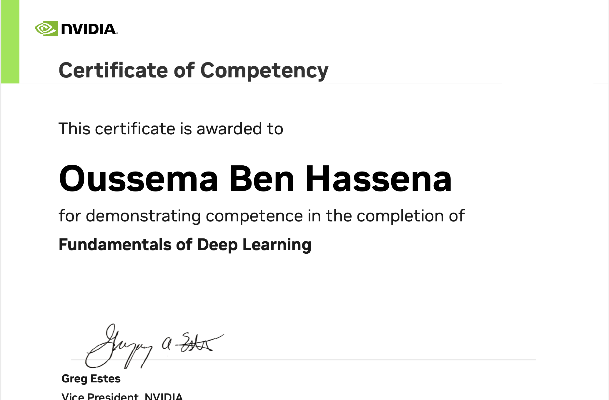
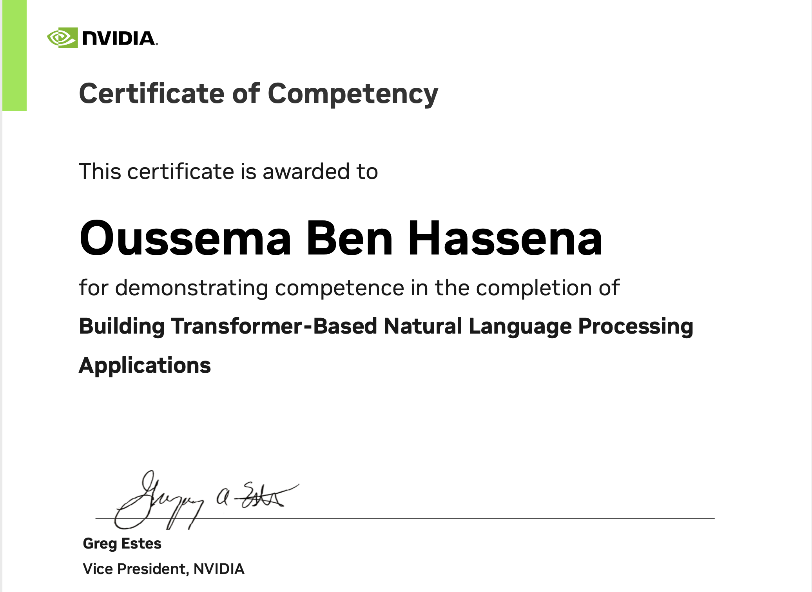
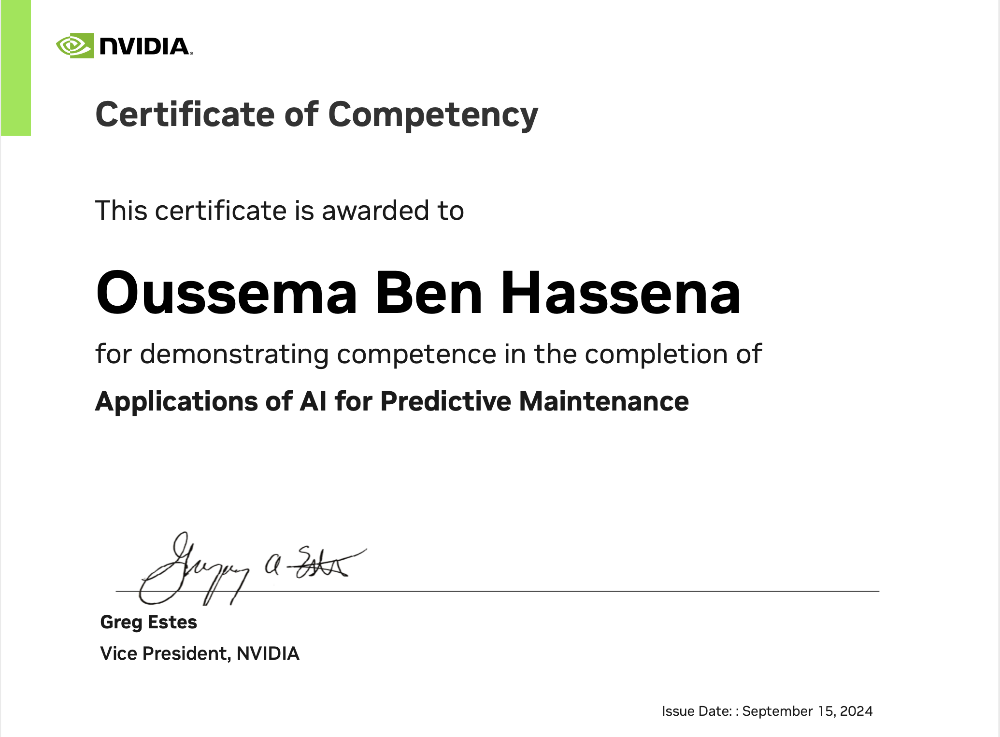
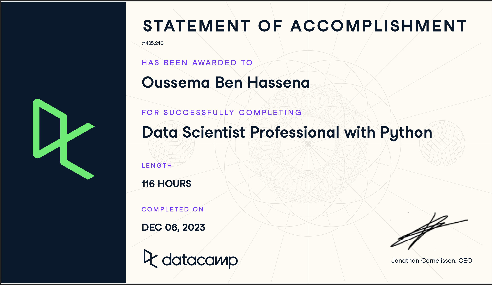
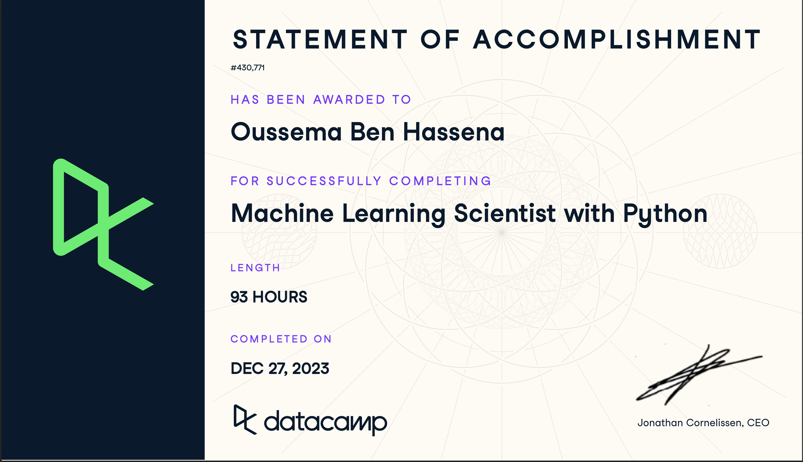

<h1 align="center">

  
</h1>
<!--
<h1 align="center"></h1>
 Write your comments here -->

### ⚡ My Tech Powers

    
  <!--  -->

### ⚡ My Toolbox

<!-- Data & AI/ML Stack -->

  

  <h3>✨ Professional Journey</h3>
            <ul style="list-style: none; padding: 0; margin: 0;">
              <li> ✅  AI Software Developer at <b>Softylines DEV</b></li>
              <li> ✅  Computer Science Student at <b>Horizon School</b></li>
              <li> ✅  Focusing on <b>RAG</b> & <b>OCR</b> softwares</li>
              <li> ✅  Building robust <b>Backend Systems</b></li>
              <li> ✅  Always exploring new technologies</li>
            </ul>

            <h3>✨ Core Expertise</h3>
            <ul style="list-style: none; padding: 0; margin: 0;">
              <li><b>AI/ML</b><span">       ▹  RAG ✦ OCR ✦ CV </li>
              <li><b>Backend</b>      ▹  Django ✦ FastAPI ✦ Docker </li>
              <li><b>Databases</b>    ▹  PostgreSQL ✦ MongoDB ✦ ElasticSearch </li>
              <li><b>Web Scraping</b> ▹  BeautifulSoup ✦ Scrapy ✦ Selenium ✦ PlayWright</li>
            </ul>

### 💫 Certifications

  <h4> ✈️ NVIDIA</h4>
  
  
  

  
<h4> ✈️ DATA CAMP</h4>

  
  
  
  

  
  <h4> ✈️ UDEMY</h4>
  

### 🌟 Let's Connect

  
  
  
  
  

 
 

    

    

 

